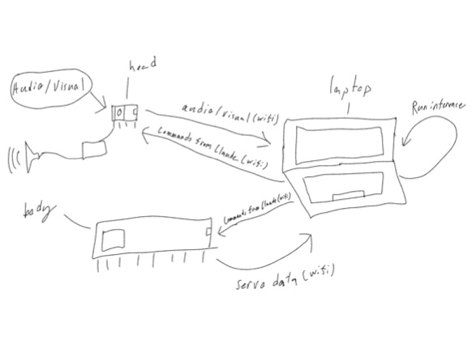

# Claude Robot
## An autonomous robot powered by claude sonnet 4.5
This is a fully autonomous robot that utilizes computer vision, and speech-to-text/text-to-speech to send
processed data for claude to direct outputs of the robot

## Project Status
- In Progress

## Architecture
### Parts Used
- Head
  - Seeed Studio Xiao Esp32S3 Sense
  - MAX98357A
    - mini 4-8 ohm Speaker
  - servo motor
  - 0.96" SSD1306 I2C OLED
- Body (Quadruped)
  - ESP32-DevKitC-32 Development Board
  - 8x MG90S all-metal micro servos
  - Buck converter (5V out, ~5A) — steps the 7.4V battery down to ~5V for the servos. Required: 7.4V would damage the MG90S (rated 4.8–6V). Sized at 5A for headroom with 8 servos.
  - Battery connector/pigtail — match the battery's connector (XT30 or JST); don't cut the stock leads.
  - 1000µF electrolytic capacitor (10V+) — across the buck output to smooth servo current surges and prevent brownout resets.
  - Silicone wire — 22AWG for power/ground, 30AWG for signal leads.
  
### Technologies Used
- C++ (Arduino framework)
- PlatformIO (build/flash)
- Ultralytics YOLOv11 (vision)
- OpenAI Whisper (speech-to-text)
- Anthropic Claude API (reasoning + tool-calling)

### Flow of Data


## How To Contribute
1. Read the [style guide](docs/style-guide.md)
2. Create a branch (`feat/your-feature`, `fix/your-fix`, `docs your-doc`)
3. Make your changes
4. Ensure all new functions/methods include Doxygen comments
5. Open a PR and fill out the checklist
6. PRs require review before merging into main

## Build & Test
### Prerequisites
- [PlatformIO Core](https://platformio.org/install/cli) (CLI) or the PlatformIO VS Code extension
    - **Github CI and native tests will not work with only PlatformIo Core**

### Compile and flash the code
```bash
pio run -e uno -t upload
```

### Run tests
```bash
pio test -e native
```
- Runs the unit suite on your machine — no board required.

```bash
pio test -e native
```
- Runs the unite suite through the arduino board

## Usage
