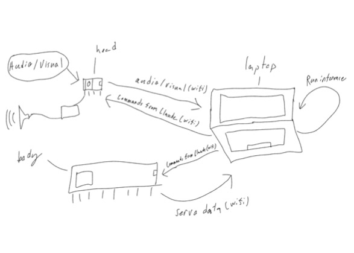

# Claude Robot
## An autonomous robot powered by claude Haiku 4.5
 \
This is a fully autonomous robot that utilizes computer vision, and speech-to-text/text-to-speech to send
processed data for claude to direct outputs of the robot

## Project Status
- In Progress

## Architecture

### Bill of Materials
| Subsystem | Part | Amazon Link |
|---|---|---|
| Head | Seeed Studio XIAO ESP32S3 Sense | https://www.amazon.com/Seeed-Studio-XIAO-ESP32S3-Sense/dp/B0C33N99BX |
| Head | NS4168 speaker driver/amp | https://www.amazon.com/Amplifier-Raspberry-Technology-Shielding-Compatible/dp/B0GGBRPKBT |
| Head | Mini speaker, 4–8Ω | https://www.amazon.com/Amplifier-Raspberry-Technology-Shielding-Compatible/dp/B0GGBRPKBT |
| Body | ESP32-DevKitC-32 development board | https://www.amazon.com/ESP32-DevKitC-Development-ESP32-WROOM-32D-Wireless-Module/dp/B091CCSPQ1 |
| Body | MG90S micro servo ×8, all-metal | https://www.amazon.com/MG90S-Servo-Motor-Helicopter-Arduino/dp/B01JY3H4MA |
| Body | Buck converter, 5V/~5A out (steps 7.4V battery down; MG90S rated 4.8–6V) | https://www.amazon.com/DROK-090581-Converter-Step-down-Transformer/dp/B00CE75K0W |
| Body | Battery connector/pigtail (match battery connector — XT30 or JST; don't cut stock leads) | https://www.amazon.com/YETOR-Connector-Pigtail-Adapter-Silicone/dp/B0GWGSDGZ7 |
| Body | Electrolytic capacitor, 1000µF 25V (smooths servo current surges, prevents brownout) | https://www.amazon.com/Pieces-1000uf-Capacitor-Aluminum-Electrolytic/dp/B07R432MR2 |
| Body | Silicone wire, 22AWG power/ground | https://www.amazon.com/StrivedayTMFlexible-Silicone-Electric-electronic-electrics/dp/B01LH1FR6M |
| Body | Silicone wire, 30AWG signal | https://www.amazon.com/StrivedayTM-Flexible-Silicone-electronic-electrics/dp/B01KQ2JNLI |
  
### Technologies Used
- C++ (Arduino framework)
- PlatformIO (build/flash)
- Ultralytics YOLOv11 (vision)
- OpenAI Whisper (speech-to-text)
- Anthropic Claude API (reasoning + tool-calling)

### Flow of Data


## How To Contribute
1. Read the [style guide](docs/style-guide.md)
2. Create a branch (`feat/your-feature`, `fix/your-fix`, `docs your-doc`)
3. Make your changes
4. Ensure all new functions/methods include Doxygen comments
5. Open a PR and fill out the checklist
6. PRs require review before merging into main

## Build & Test
### Prerequisites
- [PlatformIO Core](https://platformio.org/install/cli) (CLI) or the PlatformIO VS Code extension
    - **Github CI and native tests will not work with only PlatformIo Core**

### Connect esp32 boards to computer
- When initially connecting either esp32 boards via usb to your computer, you might find that flashing will fail or your device isn't detected. In that case you want to do the following

1. Unplug usb cable from computer
2. Hold boot button on s3
3. While holding boot button, reinsert usb and hold for 2 mississippi
4. Release boot button
5. If these steps don't work initially, retry from step 1

### Compile and flash the code
```bash
pio run -e <env_name> -t upload
```

### Run tests
## Running tests on the seeed xiao esp32 s3 sense

- Unit tests on the S3 are bugged so you gotta follow this weird workaround to run tests on the board
1. Build and flash
```bash
pio test -e test_head --without-testing
```

2. Run this command, and it should stall out
```bash
pio device monitor -e test_head --rts 1 --dtr 1
```

3. Click the reset button on S3

4. Should give stalled output, but in the output you'll find test results
```bash
test/test_head_head/test_head_head.cpp:21:test_camera_init_valid:PASS
test/test_head_head/test_head_head.cpp:22:test_init_valid:PASS
-----------------------
2 Tests 0 Failures 0 Ignored 
OK
```

5. If either of these fail, check to see if device is connected. If its not, you need to hold the boot button while inserting your devices usb. Release the boot button around 2 seconds after insertion.
```bash
pio device list
```

### Test output files
- the s3 will deliver audio and video data to the server and may write to files in /out
```bash
ffplay <relative-path-to-mjpeg-file>
```

